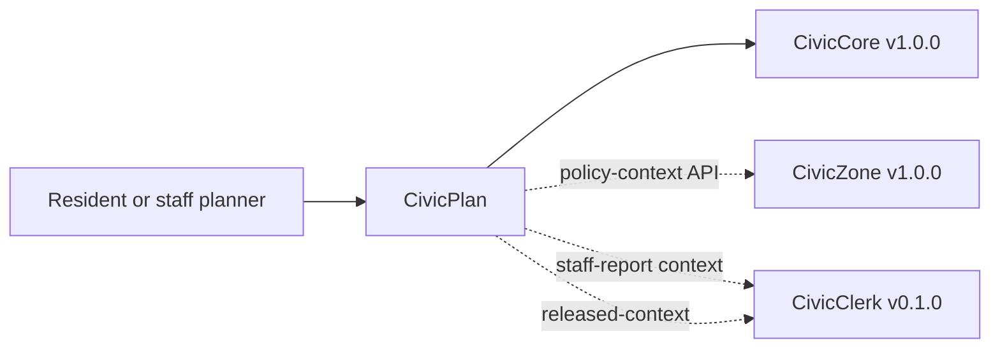

# CivicPlan User Manual

## For Residents And Municipal Decision-Makers

CivicPlan helps cities connect planning proposals to adopted plan policies. It can show sample cited policy context, highlight consistency factors for staff review, and produce records-ready plan-policy exports.

Current state: `1.0.0` product release. The module includes cited plan-policy lookup, staff-only local policy ingestion, optional database-backed policy and staff-analysis records, a goal/objective/policy navigator, cited plan Q&A, cross-plan synthesis, amendment history, progress tracking, a cited zoning policy-context endpoint for CivicZone, a draft staff-report context endpoint for CivicClerk, local adversarial integration mocks, `civiccore==1.0.0` alignment, and a public UI at `/civicplan`. It does not provide legal advice, official planning determinations, live external calls by default, permitting-system write-back, or final staff-report approval.

## For IT And Technical Staff

CivicPlan is a FastAPI Python package pinned to `civiccore==1.0.0`. The current runtime exposes:

- `GET /`
- `GET /health`
- `GET /civicplan`
- `POST /api/v1/civicplan/policies/lookup`
- `POST /api/v1/civicplan/policies/ingest`
- `GET /api/v1/civicplan/plans/navigator`
- `POST /api/v1/civicplan/questions/answer`
- `POST /api/v1/civicplan/plans/synthesis`
- `GET /api/v1/civicplan/amendments/history`
- `GET /api/v1/civicplan/progress/targets`
- `POST /api/v1/civicplan/context/zoning`
- `POST /api/v1/civicplan/context/civicclerk`
- `POST /api/v1/civicplan/integrations/mock`
- `POST /api/v1/civicplan/consistency/check`
- `POST /api/v1/civicplan/staff-analysis/draft`; persisted records require `X-CivicPlan-Role: staff` when `CIVICPLAN_POLICY_DB_URL` is configured
- `GET /api/v1/civicplan/staff-analysis/{analysis_id}` when `CIVICPLAN_POLICY_DB_URL` is configured and `X-CivicPlan-Role: staff` is present
- `POST /api/v1/civicplan/export`

Set `CIVICPLAN_POLICY_DB_URL` to persist plan-policy records and staff-analysis outlines. Persisted staff-analysis create/read routes are staff-only and require `X-CivicPlan-Role: staff` from a trusted staff or service workflow. Leave it unset for deterministic sample behavior.

Run local verification with:

```powershell
python -m pip install https://github.com/CivicSuite/civiccore/releases/download/v1.0/civiccore-1.0.0-py3-none-any.whl
python -m pip install -e ".[dev]"
python -m pytest -q
bash scripts/verify-release.sh
```

## Architecture



CivicPlan depends on CivicCore. CivicCore does not depend on CivicPlan. CivicPlan v1.0.0 exposes deterministic, review-required context contracts for CivicZone and CivicClerk; live vendor calls and official decisions remain outside CivicPlan.
